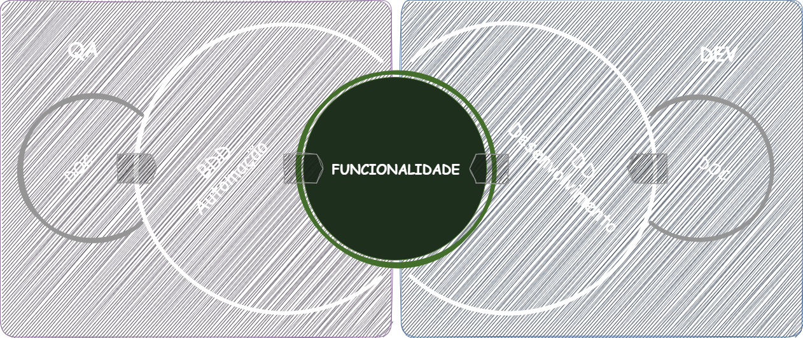
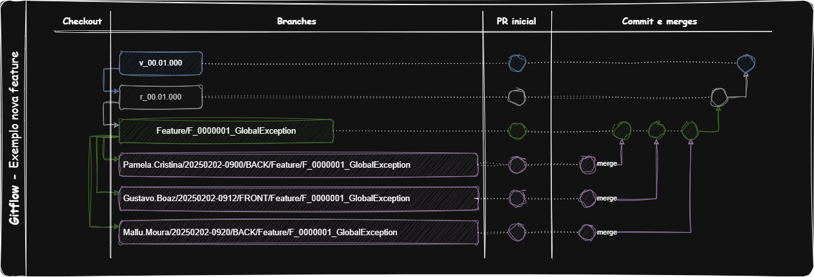
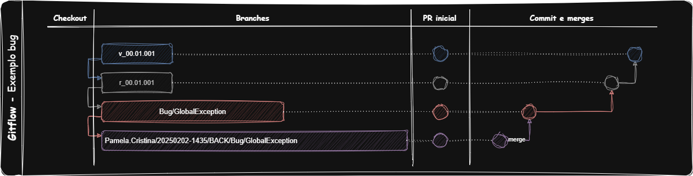
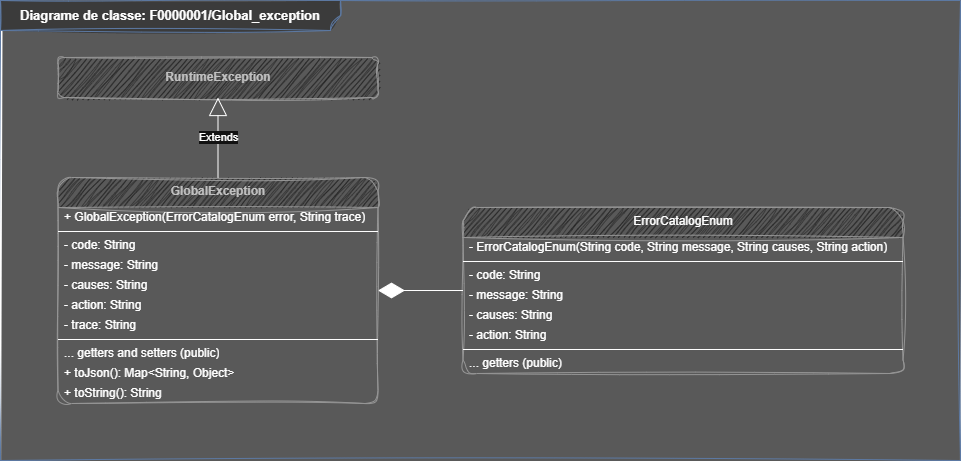

# Processo de Desenvolvimento
<details>
    <summary>🛠 Visualizar</summary>



### <span style="color: green">Novas Funcionalidades</span> - *(quando a solução não existe)*
1. **QA (Júnior)** - Adicionar uma sessão de ***feature*** no README dentro do módulo que corresponde a funcionalidade.
2. **QA - OWNER (Pleno - Sênior)** - Adicionar o Gherkin da funcionalidade no README dentro do módulo que corresponde a funcionalidade.
3. **QA (Júnior - Pleno - Sênior)** - Desenvolver a automação de testes no módulo.
4. **DEV (Júnior)** - Criar uma sessão de ***feature*** no README dentro do módulo correspondente à funcionalidade.
5. **DEV (Pleno - Sênior)** - Criar diagramas UML que representem essa funcionalidade dentro do módulo correspondente.
6. **DEV (Júnior - Pleno - Sênior)** - Desenvolver a funcionalidade no módulo correspondente.

#### Padrão para Novos Branches (sempre a partir de uma branch de release. Não apagar ao final):
- se nova funcionalidade: feature/[Título-Funcionalidade]
- se novo bug: bug/[Título-Bug]
- se novo spike: spike/[Título-Spike]
#### Padrão de Trabalho nos Branches (sempre a partir de uma branch de feature, 'bug' ou spike. Apagar ao final):
- se funcionalidade: [Responsavel]/[aaaaMMdd-hhMM]/[BACK,FRONT,OTHER]/feature/[Título-Funcionalidade]
- se bug: [Responsavel]/[aaaaMMdd-hhMM]/[BACK,FRONT,OTHER]/bug/[Título-Bug]
- se spike: [Responsavel]/[aaaaMMdd-hhMM]/[BACK,FRONT,OTHER]/spike/[Título-Spike]
#### Padrão de Commit:
- se "funcionalidade": feature/[Descrição commit]
- se "bug": bug/[Descrição commit]
- se "spike": spike/[Descrição commit]

#### Outros Padrões:
- se atualização no projeto: [Responsavel]/[aaaaMMdd-hhMM]/[BACK,FRONT,OTHER]/UPDATE-[Descrição-update]
- se criação no projeto: [Responsavel]/[aaaaMMdd-hhMM]/[BACK,FRONT,OTHER]/CREATE-[Descrição-create]
- se exclusão no projeto: [Responsavel]/[aaaaMMdd-hhMM]/[BACK,FRONT,OTHER]/DELETE-[Descrição-create]

- para pequenas atualizações: [Responsavel]/[BACK,FRONT,OTHER]/UPDATE-[Descrição-update]
- para pequenas criações: [Responsavel]/[BACK,FRONT,OTHER]/CREATE-[Descrição-create]
- para pequenas exclusões: [Responsavel]/[BACK,FRONT,OTHER]/DELETE-[Descrição-create]

<span style="color:orange">**NOTA**</span>
- Desenvolvimento deve ser feito com base na branch home.
- Para desenvolver, crie uma branch de desenvolvimento com base na branch home correspondente a Feature, Bug ou Spike.
- Pull requests devem ser feitos para a branch home. Quando o desenvolvimento estiver concluído, a branch home deve abrir um pull request para a branch de release do projeto.
- Em caso de refatorar durante o projeto, atualize primeiro a documentação Gherkin e os diagramas UML.






### <span style="color: yellow">Funcionalidades Antigas</span> - *(quando a solução existe, mas precisa de reparos e ajustes)*
1. **QA (Pleno - Sênior)** - Ajustar a sessão de funcionalidade no README dentro do módulo.
2. **QA (Júnior - Pleno - Sênior)** - Ajustar a automação de testes no módulo.
3. **DEV (Pleno - Sênior)** - Ajustar os diagramas UML que representam essa funcionalidade.
4. **DEV (Júnior - Pleno - Sênior)** - Desenvolver ou ajustar a funcionalidade.


### <span style="color: aqua">Processo de Release</span> - *(quando a solução está pronta para implantação)*
1. **DEV (Pleno - Sênior)** - Garantir que todas as funcionalidades, 'bugs' ou spikes estejam totalmente testados e aprovados no módulo.
2. **DEV (Pleno - Sênior)** - Realizar o merge da branch home na branch principal por meio de um pull request.
3. **DEV (Pleno - Sênior)** - Criar uma **branch de release** com a seguinte convenção de nomenclatura:
1. **Nome da Branch de Release:** `release/rXX.XX.XXX`
2. `rXX.XX.XXX` representa a versão do release (ex.: `r01.00.000`).
4. **QA (Pleno - Sênior)** - Realizar testes de regressão finais na branch de release.
5. **DEV (Pleno - Sênior)** - Etiquetar a branch de release com a etiqueta de versão:
1. **Tag de Versão:** `version/vXX.XX.XXX`
2. `vXX.XX.XXX` representa o número da versão (ex.: `v01.00.000`).
6. **DEV (Pleno - Sênior)** - Implantar a branch de release no ambiente de produção.
7. **QA e DEV (Junior - Pleno - Sênior)** - Acompanhar o ambiente de produção para identificar possíveis problemas pós-release.

#### Diretrizes de Versão:
- **Versão 'Major' (XX.00.000):** Mudanças significativas, novas funcionalidades ou alterações que quebram compatibilidade.
- **Versão 'Minor' (00.XX.000):** Novas funcionalidades ou melhorias sem quebrar compatibilidade.
- **Versão 'Patch' (00.00.XXX):** Correções de 'bugs' ou ajustes menores.

#### Exemplo:
- Branch de Release: `r01.02.003`
- Tag de Versão: `v01.02.003`

<span style="color:orange">**NOTA**</span>
- Certifique-se de que toda a documentação (README, Gherkin, diagramas UML) esteja atualizada antes de criar a branch de release.
- Comunique o release a todas as partes interessadas após a implantação.

</details>

<br>

---

# Pacote de Qualidade
<details>
  <summary>🛠 Visualizar</summary>

### FF0000001/Sidebar_Component/
👨‍💻Responsável por testes de aceitação do projeto. Aqui será desenvolvido a automação com BDD pelo QA.
<details>
  <summary>🛠 Visualizar</summary>

:radio_button: developing  
:white_circle: stopped  
:white_circle: done

#### Descrição

- Desenvolver um componente Sidebar para o app.
- O sidebar deve ter seções para:
    - Home de busca
    - Perfil do usuário
    - Relatórios
- O sidebar deve ser construído no pacote `remote_common`, pois será um componente compartilhado por outras páginas do sistema.
- Cada seção do sidebar deve ser um link ou botão, com redirecionamento para a funcionalidade correspondente.
- O sidebar deve ser responsivo, adaptando-se bem em dispositivos móveis e desktops.
- O sidebar deve ter um estilo visual consistente com o restante do sistema.
- O sidebar deve ter a opção de ser aberto e fechado, oferecendo uma boa experiência de navegação.
- O código do sidebar deve ser modular e reutilizável, permitindo fácil manutenção e atualização.
- A criação do componente Sidebar deve seguir as melhores práticas de acessibilidade, incluindo navegação por teclado.

#### Gherkin
```gherkin
Feature: F0000002/Sidebar_Component
  """
  Como desenvolvedor front-end, quero criar um sidebar compartilhado para o app.
  O sidebar deve incluir links para a home de busca, perfil e relatórios.
  Ele será construído no pacote remote_common para ser reutilizado em várias páginas do sistema.
  O sidebar deve ser responsivo e acessível, proporcionando uma boa experiência de usuário.
  """

  Scenario Outline: F0000002/Sidebar_Component
    Given que o componente sidebar foi carregado
    When o usuário acessa as seções "<home_section>", "<profile_section>" e "<reports_section>"
    Then o sidebar deve exibir os links correspondentes para cada seção
    And o sidebar deve ser funcional e redirecionar para as páginas corretas ao clicar nos links

    Examples:
      | home_section     | profile_section | reports_section  |
      | Home de busca    | Perfil          | Relatórios        |
```

</details><br>

### Version

| Versão  | Descrição          |
|:--------|:-------------------|
| `00.01` | Versão inicial     |

<br>
</details>

# Pacote de Desenvolvedor
<details>
  <summary>🛠 Visualizar</summary>

### FF0000001/Sidebar_Component/

<details>
  <summary>🛠 Visualizar</summary>

:radio_button: developing
:white_circle: stopped
:white_circle: done

### Diagramas:



</details><br>

### Version
| Versão  | Descrição             |
|:--------|:----------------------|
| `00.01` | Versão inicial        |

<br>

</details>

<br>

---